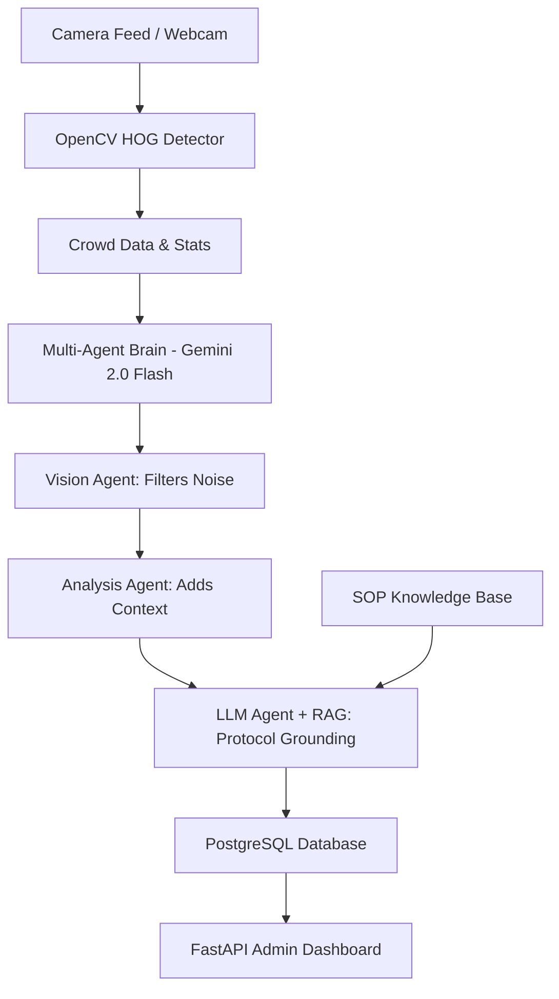

# CopAssist AI – Intelligent Patrol & Surveillance System

### Final Submission for AI/ML Engineer Screening Task (CopMap)

CopAssist AI is a modular surveillance analysis system designed to assist law enforcement during **Bandobast** (security arrangements), **Patrolling**, and **Nakabandi** (checkpoints). 

---

## 1. Problem Understanding: AI in Police Operations

### Where AI fits realistically
- **Continuous Monitoring**: AI doesn't get tired; it can monitor hundreds of CCTV feeds for density spikes.
- **Protocol Grounding**: Providing real-time SOPs to officers via RAG avoids human memory errors under pressure.
- **Pattern Detection**: Spotting suspicious gatherings at unusual hours (e.g., 3 AM).

### Automated vs. Assisted
- **Automated**: Data extraction (counting people, detecting objects, logging events).
- **Assisted**: Decision making. AI *suggests* actions based on SOPs, but the human officer makes the final call.

### Risks of False Positives
- **Scenario**: A midnight religious festival could be flagged as an "Unauthorized Gathering."
- **Mitigation**: Our **Analysis Agent** considers the calendar/local events before escalating to **Critical**.

---

## 2. System Architecture



---

## 3. Implementation Details

- **CV Model**: Using OpenCV's **HOG (Histogram of Oriented Gradients)** + SVM for lightweight, out-of-the-box person detection.
- **Multi-Agent Brain**: Decoupled agents for **Vision**, **Contextual Analysis**, and **Decision Making**.
- **LLM**: **Gemini 2.0 Flash** for low-latency reasoning.
- **RAG Layer**: Indexed police protocols using **Qdrant** (in-memory) for grounded alerting.
- **Database**: **PostgreSQL** (SQLAlchemy) for persistence of all telemetry and alerts.

---

## 💰 Cost-Aware Prompt Strategies
1.  **Summarization Tunnels**: Raw JSON is summarized by the Vision Agent to save tokens in downstream reasoning.
2.  **Instruction-Only Prompts**: Zero-shot prompting with clear schemas to minimize input length.
3.  **Smart Escalation**: Vector DB lookups are only triggered if a threshold breach (e.g., > 20 people) is detected.

---

## 🛠️ How to Run

1.  **Clone & Install**:
    ```bash
    uv sync
    ```
2.  **Initialize DB**:
    ```bash
    uv run alembic upgrade head
    ```
3.  **Start API**:
    ```bash
    uv run uvicorn src.main:app --reload
    ```
4.  **Start CV Detector (Webcam)**:
    ```bash
    uv run python src/cv/detector.py
    ```

---

## 💥 Trade-offs & Decisions
- **Chosen OpenCV over YOLO**: To ensure the submission is portable and runs on regular PCs without GPU bottlenecks during a live screening.
- **Gemini Over OpenAI**: Better tokens-per-dollar and faster response times for real-time telemetry.

**Author**: Neel (Screening Candidate)
**Project**: CopAssist AI
